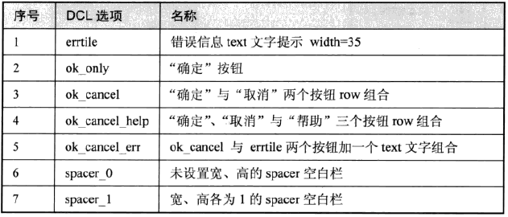

# autolisp

## 书籍

[AUTOCAD完全应用指南高清版(吴永进魔法书新书).pdf](E:\Z-StudyMaterials\lisp资料\AUTOCAD完全应用指南高清版(吴永进魔法书新书).pdf)

教材1[E:\Z-StudyMaterials\lisp资料\AUTOCAD完全应用指南高清版(吴永进魔法书新书).pdf](E:\Z-StudyMaterials\lisp资料\AUTOCAD完全应用指南高清版(吴永进魔法书新书).pdf)

教材2[E:\Z-StudyMaterials\lisp资料\Visual LISP开发者宝典.pdf](E:\Z-StudyMaterials\lisp资料\Visual LISP开发者宝典.pdf)


## 语法

- setq 给一个变量赋值

- list建立一段数据集合

- command 调用命令行

- getpoint 让用户选择一个点

- defun 表示我们开始编写一段函数，因为需要在系统里面注册命令，所以命令的格式为 C:后面跟你定义的命令。这段代码的执行命令就是 TT

```lisp
(defun c:tt()
    (setq 点1 (getpoint "\n请选择第一个点”))
    (setq 点2 (getpoint "\n请选择第二个点"))
    (command "line" 点1 点2 "")
)
```

- EntLast 获取上一个图元， (setq 刚才画的线 (entlast))

- car 取出表中第一个值用 CAR 函数

- entsel 选择一个图元

- 对象名：除了图元名还有个对象名，这是 vlisp 里面新的称呼，我们用这个代码来把图元转为对象名。
  seta 选择的对象 (vlax-Ename->Vla-0bject 选择的图元)
  或者:
  (seta 选择的对象 (Vlax-Ename->Vla-0bject (car (entsel)))
- V-Load-Com 函数用于加载 vla 开头的函数,在每个程序的开头加一句即可,不用每句话都加,后面的代码我们都认为程序已经先写了这个函数.
  旧版的 CAD,有些没有加载这个函数,会造成一些函数无法找到

### 流程控制

if

progn

cond 会根据判断结果匹配条件，[第7集AutoLisp流程控制函数1_哔哩哔哩_bilibili](https://www.bilibili.com/video/BV1kb411V7K8?p=7&spm_id_from=pageDriver&vd_source=71766beb4ab755e8dfb4543e1008fa76)

repeat

while

图元

entsel

entnext

entlast

entget

### 对象属性相关函数

- 2.1 (entsel[提示]) 请求选择一个对象，返回包含对象名称及选点坐标的列表
- 2.2 (car列表) 返回列表中的第一个元素 (通常用来求x坐标)
- 2.3 (cadr列表) 返回列表中的第二个元素 (通常用来求y坐标)
- 2.4 (caddr列表) 返回列表中的第三个元素 (通常用来求z坐标)
- 2.5 (cdr列表) 返回除去第一个元素后的列表
- 2.6 (entlast) 取出图形对象中的最后一个属性
- 2.7 (entget 称[应用序列表])   取得对象名称的属性联合列表
- 2.8 (assoc关键元素联合列表) 按关键元素寻找联合列表中的关系属性
- 2.9 (cons新素列表)  返回:将新元素结合到列表 (常用于产生“点对列表”
- 2.10 (subst新项项列表) 返回:替换旧列表后的列表
- 2.11 (entmod对列) 按更新的属性列表更新屏幕上的对象
- 2.12  (list 元素元素···) 返回:将元素合并成一列表

### 子程序

defun function  # 不加c:，命令行中调用（function）

### 选择集


### 读写文件


114

## 函数

- defun c: function(a b / c d) # 加c:命令行中调用function
  - 在使用 (defun C:函数名(自变量/更改变量)···)的中，变量在“/”右边变量内，则称为局部变量，否则为全局变量(注:在 AutoLISP 中，未赋予值的变量，其返回值皆为 ni)。
    局部变量:在程序执行完毕后，其值自动消失
    全局变量:在程序执行完毕后，其值仍然存在。

defun function  # 不加c:，命令行中调用（function）


- 获取对象起点

		使用对象名处理的方法：
		(Vlax-Get (Vlax-Ename->Vla-0bject (car (entsel)))'StartPoint)
		使用图元名处理的方法：
		(cdr (assoc 10 (entget (car entsel))

- 获取图层名

```lisp
(vl-load-com)
(defun C:SHOWLAYER (/ ent)
  (while (setq ent
		(entsel)
	 )
    (princ
      (strcat "\nLayer:"
	      (vla-get-Layer
		(vlax-ename->vla-object (car ent))
	      )
      )
    )
  )
  (princ)
)
```

getpoint

getdist

(setvar "cmdecho" 0)  命令栏中不显示回显

setvar "osmode" 0 关闭对象捕捉

polar 返回一个点

- 


## 3.12 DCL对话框 P217

### 1 自我介绍:我不多花你一毛钱

### 2 我是AutoLISP的好帮手!

### 3 DCL犹如千面女郎，变化多端!

### 4 DCL身在何处

### 5 谁必须学DCL

### 6 如何设计精彩的DCL对话框画面

### 7 两个最重要的DCL文件

在 AutoCAD 的SUPPORT 文件夹下，有两个重要的 DCL 文件，若非必要，不要轻易修改以免造成AutoCAD 无法正常运行。
BASE.DCL，包含 DCL的初始定义及集成DCL对象定义。
QACAD.DCL，包含AutoCAD 所使用到的各个DCL 画面，是一个不错的学习文件。

### 8 DCL对话框组介绍

#### 组一 标准内定的 DCL 对话框


#### 组二 美化性的DCL选项组

特性:不能选择，也不会有动作，纯粹用来美化对话框的画面、信息显示及视觉强调。


#### 组三 群集配置的DCL对象

特性:用来设置各 DCL对象的排列方式


#### 组四 标准预设的整合 DCL

特性:定义于 BASE.DCL 中的整合设计 DCL对象可以直接使用，有助于更快速地完成所需的 DCL 设计。



## 3.13 轻松、简单、快速地进入DCL天地

### 1 DCL对话框的特点与关键

### 2 DCL基本语法结构十大规则

规则1 以文件类型存在的DCL程序(ASCIⅡ文件)，其扩展名最好是.DCL。

规则4 DCL程序中的批注有两种方式（请注意，不能用AutoLISP中的分号“；”）

- 第一种方式：加上两个斜线“//”，双斜线后的一行文字为批注。
- 第二种方式：/* 之间的文字内容不受行数限制 */。

规则5 DCL程序设计的基本结构。


规则7 DCL对象与对象属性请务必用小写英文字母表示。对于未定义的对象属性，DCL会自动带入默认值。

规则9 DCL的加载若语义有误，AutoCAD会出现警告窗口，如图13-1所示。错误会被记录于工作文件夹内的ACAD.DCE,读者只要使用记事本打开它，就能知道哪里发生了错误，如图13-2所示。

### 3 预览DCL对话框


dia_name要与DCL中对话框名一致

### 4 新手上路DCL设计轻松入门

### 5 最重要的DCL文件-BASEDCL

### 6 观摩学习AutoCAD的DCL文件

### 7本章结语

## 3.14 DCL对话框的对象属性定义速查

### 1 DCL对象属性速查总表 P261

### 2 各DCL对象属性分析速查表

## 3.15 AutoLISP掌控DCL的关键技巧

### 1 新手上路：出发前的叮咛

### 2 AutoLISP掌控DCL相关函数一览表 P274

### 3 加载与释放DCL文件


### 4 激活与终止dialog对话框


### 5 选择与触发DCL对象后连接、调用子程序

### 6 DCL对象效果处理及数据的设置与取得

### 7 处理列表框list_box与下拉菜单popup_llist

### 8 处理图像image与图像按钮image_button

### 9 DCL对话框调用不能执行的AutoLISP函数

## 规则技巧

双击(  会标示）

nil 与 “” 有时候不相同，没有输入的时候为""

- (setq pt3 '(11 123))    '(11 123)表示点列表，或者(setq pt3 (list 11 123))

- 副选项中，“”代表enter键

’(） 生成一个空列表

蓝色：内置函数；黑色：变量;绿色：数字


## 注意事项

字符串比较时，大小写不同

caipanshu  123qweasdZ

- !变量 用来查询变量

## 问题

print  “str” 会和回车引号一起输出

princ “str” 会输出str

prin1


- vlax-put,vlax-get和vlax-put-prpperty,vlax-get-prpperty区别

http://bbs.mjtd.com/thread-57637-1-1.html


python cad

pythoncom

win32com

您好。  我倒是觉得恰恰相反，COM资料极其丰富

官方ActiveX API的详细文档，每个版本都更新发布，说明、实例极其详细，，。这些VBA实例都是COM的调用方法照抄就好，python与之完全相同，基本没任何差别。同理你用Java，swt.win32调用com也是一模一样的，，那个Java更加的方便无所不能。。

我认为com的优势就是：资料丰富，操作标准通用

目前 Py调用Lisp，我用的是com接口SendCommand方法；可能这是最土的办法，不知道还有啥其他办法；；
Lisp调用Py，我用 (command “shell” “d:\\xxx\\xxx\\xx.py") ; 这个有黑窗口，比较郁闷。。


我用的不是你这些方法，这几天我把用我的方法实现非模态对话框的效果弄好了，就放出来。
但是我的方法需要用py注册com server,这个在win10非常难搞。考虑的win10现在普及度这么高，可能也是个大问题。
另外com虽然便利，但功能相对.net来说其实弱鸡很多。
com里面也没法实现如lisp中grread的动态效果，使用事件会崩溃等。。
但是跟py结合的一大好处是可以利用py大量丰富的第三方库，


 https://help.autodesk.com/view/OARX/2023/ENU/

[[源码\]](http://bbs.mjtd.com/forum.php?mod=forumdisplay&fid=3&filter=typeid&typeid=28) **原创！Vlisp与Cpython无缝联合开发CAD** http://bbs.mjtd.com/thread-185424-1-1.html

有人Python开发Autocad吗？都是COM，好像很少讨论
http://bbs.mjtd.com/forum.php?mod=viewthread&tid=185262&fromuid=7319936

## 

# visual lisp

## 介绍

visual lisp 是 AutoLisp的超强进化变身

- 色彩化展示


- 自动排列格式
- 自动匹配结果
- 快速预览DCL
- 新增新函数
  - vl
  - vla
  - vlax
  - vlr
- 支持ActiveX对象的访问
- 提供编译的AutoLisp程序
  - fas后缀 （vlisp-complie "filepath"）

## 基本环境

### 控制台

1. 输入变量不用加！号
2. 可以同时输入多行命令，【Ctrl+Enter】换行
3. esc舍弃目前表达式
4. Tab 、Shift+Tab上下翻命令

### 文字编辑器

1. 文字排列格式的调整与修改
   - 

1. 程序的加载与执行
   - 

1. 检查程序的语法错误
   - 

1. 适用函数快速替代法
   - 选中函数 按Ctrl+Shift+SpaceBar
2. 书签-协助浏览与查看程序

### 快捷键

1. 选择功能的快捷键
   - 
2.  浏览功能的快捷键
   - 
3. 修正功能快捷键
   - 
4. 缩进功能快捷键
   - 
5. 书签功能快捷键
   - 

## 新增重要函数


### 1 列表处理新增函数

### 2 字符串、字符、符号处理新增函数

### 3 文件处理新增函数

### 4 AutoCAD相关的查询、控制新增函数

### 5 名称空间通信新增函数

### 6 Windows登录新增函数

7 错误处理新增函数

8 ActiveX对象处理新增函数

9 ActiveX方法与特性处理新增函数

10 ActiveX集成对象处理新增函数

11 ActiveX数据转换新增函数

12 字典处理新增函数

13 LX名称空间函数

14 反应器处理新增函数

15 VBA处理新增函数

16 曲线测量新增函数出

## 程序调试

### 1 调试功能：检查Visual LISP的程序括号对称


### 2 调试功能：用颜色来协助判断Visual LISP函数

修改颜色：工具->属性窗口

### 3 调试功能：.智能的程序语法错误检验


### 4 调试功能：设置断点逐步执行程序

### 5 Visual LISP的数据类型检验功能

### 6 Visual LISP调试工具栏速查

### 7 本章结语

## AutoCad ActiveX对象控制

### 1 传统AutoLISP DXF群码控制对象的缺点

1. 群码不容易记
2. 更新对象数据不易
3. 不易与外界主流程序交流
4. 以DXF群码数据为桥梁，等于在控制上多了一个第三者，间接处理对象，速度受影响

### 2 新一代AutoCAD ActiveX对象控制的优点

亲和性强一目了然

不用记群码，只记得对象特性与方法即可

更新对象数据更容易

目前符合主流程序语言对象数据架构与访问格式

访问对象不用通过群码，而采用直接的控制，速度更快

### 3 AutoCAD ActiveX对象模型架构图

### 4 AutoCAD ActiveX对象的特性与方法

### 5 AutoCAD ActiveX函数的加载与对象转换

(vl-load-com)	

如果处在AutoCAD程序开发环境中，则建议你将这一行加到acad.lsp或acaddoc.lsp中，或搭配menu菜单加到MNL文件中。但是如果程序是受委托开发的独立系统，请务必在程序中添加此行，免得产生程序无法顺利执行的错误。


查看Autolisp对象与VLA对象方法

- (entget en)
- (vlax-dump-object)

创建最关键的AutoCAD应用程序对象、图形文件与模型对象

`(setq acadobj(vlax-get-acad-object)) ←非常重要，关键母体就是它
(setq dwgobj(vla-get-ActiveDocument acadobj)) ←取得目前打开图形文件对象
(setq mspace(vla-get-ModelSpace dwgobj)) ←取得模型空间集合对象`

### 6 主要的ActiveX对象控制函数


### 7 查看AutoCAD ActiveX对象特性

### 8 AutoCAD ActiveX的集合对象

### 9 整合Excel、Word及其他应用软件的关键

### 10 转换AutoLISP数据类型为ActiveX数据类型

### 11 解除对象与释放内存

### 12 本章结语

## 2D对象

### 1 本章重要函数一览

### 2 模型空间集合对象可用的方法

### 3 踏出掌握ActiveX创建2D对象的第一步

### 4 如何掌握正确语法控制“对象方法”

### 5 踏出掌握ActiveX2D对象特性的第一步

### 6 如何掌握正确的2D对象特性

### 7 轻松取得特性资料的两种技巧

### 8 踏出更新ActiveX2D对象特性的第一步

### 9 轻松更新对象特性数据的两种技巧

### 10 充分掌握2D对象的方法

### 11 精选范例：取得任意两对象的交点

### 12 精选范例：执行矩形数组方法

### 13 本章结语

## 3D对象 P436

### 1 本章重要函数一览 

| 1.1 (vl-load-com)                         | 加载延伸的功能函数                            |
| ---- | ---- |
| 1.2(vlax-dump-object 对象)                | 列示对象的方法与特性                          |
| 1.3 (vlax-get-acad-object)                | 取得目前AutoCAD应用程序的母体对象             |
| 1.4(vlax-get-property 对象 特性)          | 取得ActiveX对象特性                           |
| 1.5(vlax-put-property 对象 特性 自变量)   | 更新ActiveX对象性                             |
| 1.6(vlax-cnamc->vla-object 对象)          | 将AutoLISP对象转换为VLA对象                   |
| 1.7(vax-3D-point 坐标列表)                | 台将一般坐标列表转换为 ActiveX 兼容的3D点结构 |
| 1.8 (vlax-3D-point X Y [Z])              | 将一般坐标转换为ActiveX兼容的3D点结构 |
| 1.9(vlax-safearray->list 安全数组)        | 以列表类型返回安全数组的元素 |
| 1.10(vlax-variant-value 变量)           | 返回变量值 |
| 1.11(vla-get-activedocument 应用程序对象) |取得作用中的文件或图形文件|
| 1.12(vla-get-modelspace 图形文件对象)| 取得图形文件对象模型空间 |

4标 tangwanba大桥取消

### 2 模型空间集合对象创建3D对象的方法


### 3 踏出掌握Activex创建3D对象的第一步

### 4 如何掌握正确语法控制“对象方法”

### 5 精选范例:活用3D实体的Boolean布尔运算

### 6 踏出掌握ActiveX3D对象特性的第一步

### 7 如何掌握正确的3D对象特性

### 8 两种技巧轻松取得想要的特性资料

### 9 3DSOLID的方法一览表

### 10 本章结语

## 文字编辑 P450

### 1 本章重要函数一览

|1.1 (vl-load-com)|加载延伸的功能函数|
| ---- | ---- |
|1.2(vlax-dump-object 对象)|列示对象的方法与特性|
|1.3(vlax-get-acad-object)|取得目前AutoCAD应用程序的母体对象|
|1.4(vlax-get-property 对象 特性)|取得ActiveX对象特性|
|1.5(vlax-put-property 对象 特性 自变量)|更新ActiveX对象特性|
|1.6(vlax-invoke-method 对象 方法 自变量)|调用指定的对象方法|
|1.7(vlax-ename->vla-object 对象)|将AutoLISP对象转换为VLA对象|
|1.8(vlax-3D-point 坐标列表)|将一般标列表转换为ActiveX容的3D点结构|
|1.9(vlax-3D-point X Y [Z])|将一般标转换为Activex兼容的3D点结构|
|1.10(vlax-safearray->list 安全数组)|以列表类型返回安全数组的元素|
|1.11(vlax-variant-value 变量)|返回变量值|
|1.12 (vlax-for 集合对象 达式)|将集合对象内各对象逐一执行表达式|
|1.13(vla-get-activedocument 应用程序对象)|取得作用中的文件或图形文件|
|1.14(vla-get-modelspace 图形文件对象)|取得图形文件对象的模型空间|
|1.15(vla-get-textstyles 图形文件对象)|取得图形文件对象的字体集合对象|

### 2 踏出STYLE字体对象访问与控制的第一步

### 3 新建STYLE字体对象的方法

(setq sty2(vla-add stylesobj "cc"))
(vla-put-bigfontfile sty2 "chineset.shx")
(vla-put-fontfile sty2 "simplex.shx")

### 4 取出所有STYLE字体的技
### 5 新建文字AddText方法

### 6 精选范例:创建简易词库

### 7 踏出掌握文字对象特性的第一步

### 8 轻松取得文字对象特性数据的两种技巧

### 9 轻松更新文字对象特性数据的两种技巧

### 10 精选范例:更新文字对象特性

### 11 本章结语

## 图层管理 P466

### 1 本章重要函数一览

| 1.1(vl-load-com)                         | 加载延伸的功能函数                |
| ---------------------------------------- | --------------------------------- |
| 1.2(vlax-dump-object 对象)               | (列示对象的方法与特性             |
| 1.3 (vlax-get-acad-objcct)               | 取得当前AutoCAD应用程序的母体对象 |
| 1.4(vlax-get-property 对象 特性)         | 取得ActiveX对象特性               |
| 1.5(vlax-put-property 对象 特性 自变量)  | 更新ActiveX对象性                 |
| 1.6(vlax-invoke-method 对象 方法 自变量) | 调用指定的对象方法                |
| 1.7(vlax-ename->vla-object 对象列表)     | 将AutoLISP对象列表转换为VLA对象   |
| 1.8(vlax-for-obj 集合对象 表达式)        | 将集合对象内各对象逐一执行表达式  |
| 1.9(vla-get-activedocument 应用程序对象) | 调用指定的对象方法件              |
| 1.10(vla-get-modelspace 图形文件对象)    | 取得图形文件对象的模型空间        |
| 1.11(vla-get-layers 图形文件对象)        | 取得图形文件对象的图层集合对象    |

### 2 踏出LAYER图层对象访问与控制的第一步

### 3 新建LAYER图层对象的方法

### 4 取出所有LAYER图层的技巧

### 5 精选范例:创建简易图层管理

### 6 完整的图层管理程序与DCL真面目

### 7 新旧图层列表获取技巧差异比较

### 8 本章结语

## 块与属性管理

## Options选项控制

## Excel

## Word

## 程序的创建与维护

