## cad

1. 删除重复线，命令OVERKILL
1. 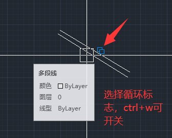

## 纬地

### 横断面详细设计

1. 横断面戴帽中，低填路基设置为边沟可设置如下图：

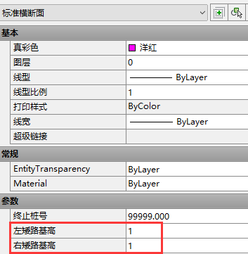

2.排水沟沟底标高设置

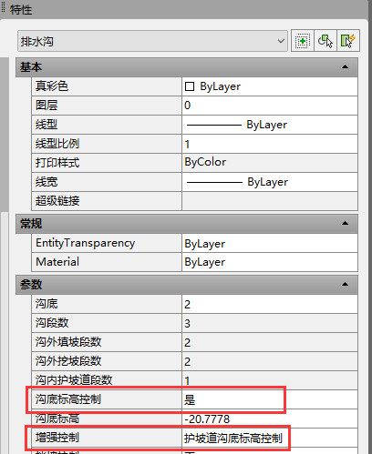

3. 路基设计计算
   1. 横断面地面线中没有的桩号不会更新（重视，路线平面调整后，路基设计计算可能更新不到部分横断面）

### 路基设计计算

1. 计算桩号源自纵断面地面线

## EI命令

1. EI匝道接线坡度计算

- cgc 查高程
- ccg 查超高
- wo渐变过度

2. EI横断面设计

- JP(eqe)命令合并土路肩边线、硬路肩边线，改颜色（左土路肩11-左硬路肩12-右硬路肩22-右土路肩21）
- 横断面模板中颜色与上面一致，宽度栏指定，

- 创建边坡模板CSLP

- 创建道路模型HLJ
- 横断面戴帽HDM(ehs) -> 指定边坡模板、指定GZW
- 路基路面 -> 提取边沟线 -> 修改边沟
- 创建边坡模板(引用沟底高程)CSLP，设置沟壁厚度后，是否绘图：是，横断面图中要生成沟壁
- 横断面戴帽HDM(ehs)-> 指定上一步边坡模板 -> 沟外边坡(填、挖)都要有

- 测试边坡模板是否戴帽成功：
- 生横断面图Ei_HDMT(eht): 占地宽度的设置
- 总体图边坡、边沟线(ebq): 平面设计 -> 平面辅助绘图 -> 第二栏绘制边坡边沟线

## 公路BIM

### 数量

公路BIM主线数量中是包含互通主线段数量的

### 互通翻模

#### 鼻端

1. 从匝道从左侧汇入，且从匝道由单变双（或者由双变单）时，由于软件默认从右侧减（或者加）一个车道（3.5m），如果单变双渐变方式不同，则软件算出的鼻端桩号会发生错误，解决方法如下：例成渝扩能优化-斑竹山互通
   - 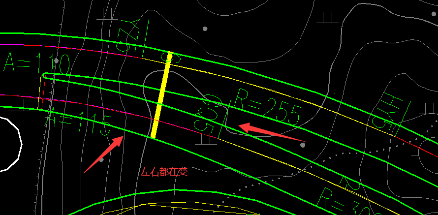
   - 第一步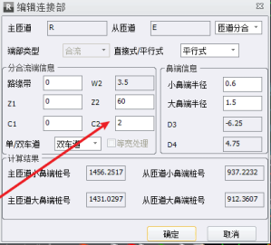C2就是从匝道右侧小鼻端到土路肩的距离，Z2就是渐变到C2所用长度
   - 第二步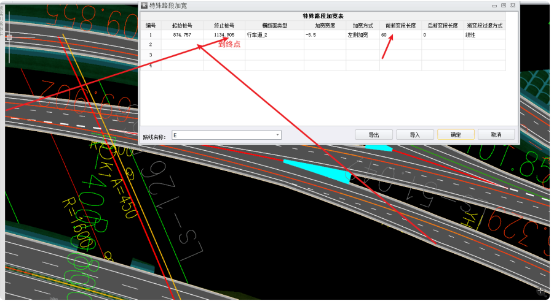左侧宽度用特殊加宽实现。

#### 硬路肩

1. 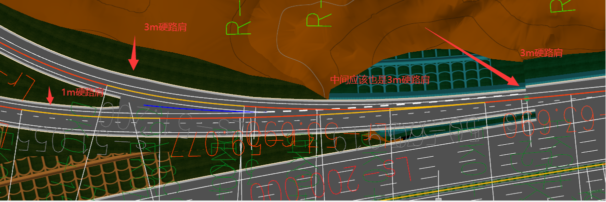解决方法：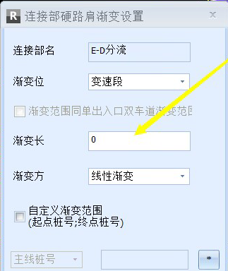，然后用特殊加宽增加硬路肩宽度

1. 主线硬路肩2.5m，匝道硬路肩3.0m，宽度衔接
   1. 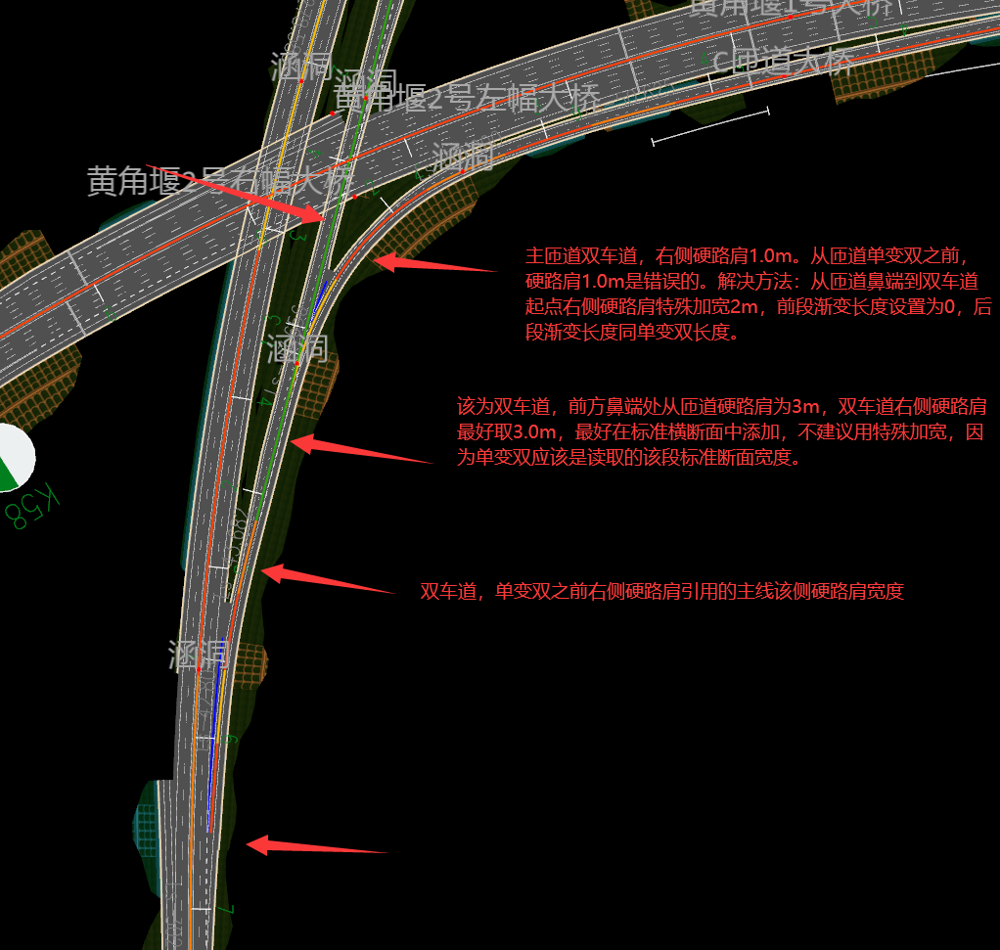

#### 横断面

1. 原因1：鼻端设置错误

### 分离式路基设置

1. 左线、右线都设置为整幅路基
2. 端部设计 -> 分离式路基
3. 构造物设计 -> 路线横断 -> 添加横断面 -> 左右幅都要设置，如下图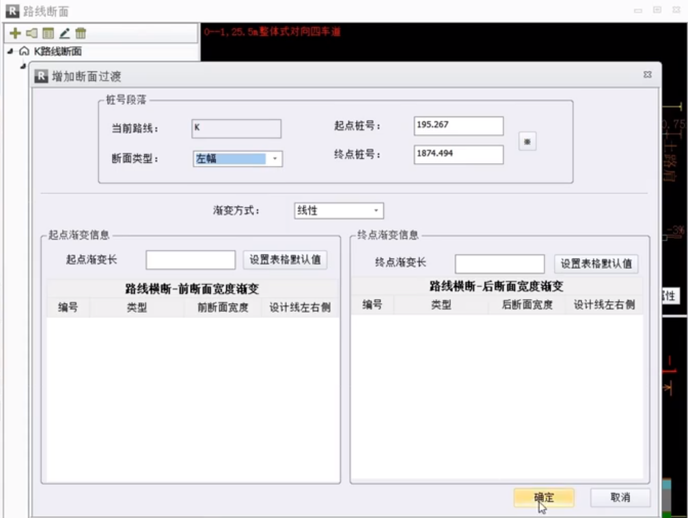

4.构造物设计 -> 边坡 -> 边坡过度

### 构造物

#### 桥梁

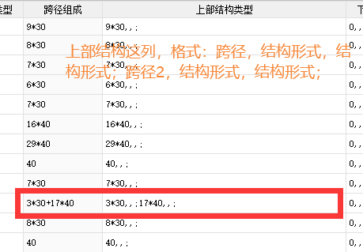

软件中挖出来的桥梁，土石方路基中没有记

#### 涵洞

### 边坡

#### 接坡

1. 两侧都为填方
   1. 都要重置为挖方
   2. 设置如下

### 排水

1. 排水沟沟外坡问题

   - 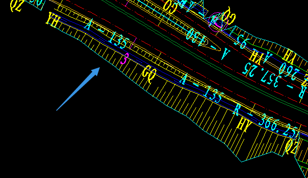

   - 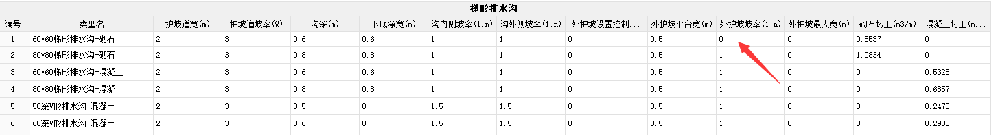

### 其它

- 鼻端无法求解情况

  - 路线改为导线法，再试

- 平面图中鼻端生不出来时

  - 路线包中主线起止桩号要设置正确，全为0时可能出问题

- ctrl+双击鼠标左键：添加超高过渡点

- 互通平面图中匝道总宽度正确，左、右侧路基宽度偏差8mm左右。

  - 解决方法：用标高数据图中边线
  - 方法二：取消勾选下面选项
  - 勾选上之后平面图里路基边线的圆弧都用多段线代替，方便出图的时候，上跨下穿位置裁剪，但左右路面宽度会有偏差。

- 路拱线中的长度就是指超高渐变的长度（从小鼻端开始）

- 用实侧地面线构建地模

  - 方法：导入实侧数据，gis资料那里构建实测tin或者鼠标右键-弹出窗口中构建实测tin
  - 

- 占地宽度设置

  - 

- 断面渐变设置

  1.先设置断面 

​	2.设置渐变段

### 改沟

目前版本不能放坡，只能用改路变通，标准横断面中路基模块识别不了人行道，不加宽，土路肩坡比1:1对应100%

### 土石方调配

跨线调动前要用核查功能，路线只剩挖余或填缺

### 出图

#### 互通

1. 总体模块中，无法生出互通横断面，

   - -> 复制互通路线包  -> 改为一般路线包 -> 再设置图册方案 -> 施工图主线方案 -> 选中主线和复制后的匝道

   - 互通主线路面数量表（同理）

#### 左右线标注冲突

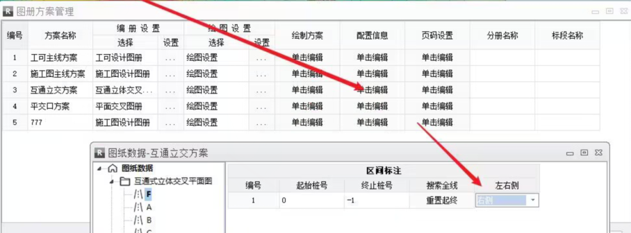

### 用地

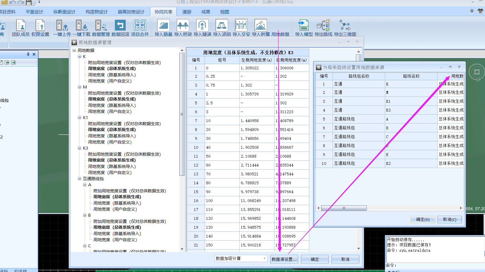

### BUG

1. `M~ESZR[@G]G}~Y~4E.png)
   - 筛查出问题线路删除，新建该平纵面，不要点重新生成，生成的总体图会带边坡，如下：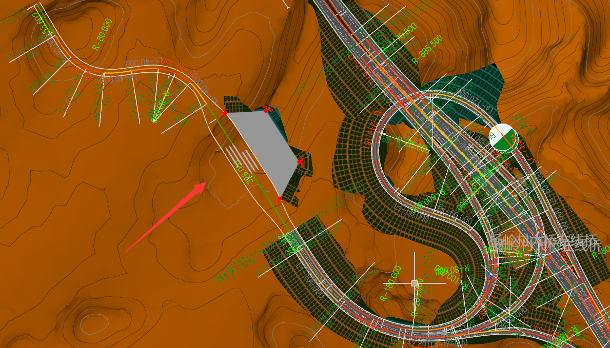