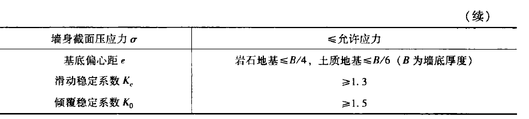

# 书籍

《公路隧道设计与施工新法》 朱汉华 尚岳全

# 《公路隧道设计与施工新法》 朱汉华 尚岳全

## 1 新奥法指导思想及其发展

### 1.1 新奥法基本原理

​	“新奥法”是“新奥地利隧道修建方法”的简称其英文为“New Austria Tunneling Method”常简写为“NATM”是由奥地利上木工程师 Rabcewiez、Muller 在20世纪60年代总结隧道建造实践经验的基础上创立的。
​	总之,新奥法的**核心**在于充分发挥围岩的自承作用,喷射混凝杆起加固围岩的作用把围岩看作是支护结构的重要组成部分,并通过监控量测,实行信息化设计和施工,有控制地调节围岩的变形，以最大限度地利用围岩自承作用。

### 1.2 新奥法的发展过程及思考

1. 在硬岩隧道中采用新奥法
2. 在软岩(土)隧道中采用新奥法，一开始就抓住了问题的关键,提出了既科学又全面的**“管超前、严注浆、短开挖、强支护、快封闭、勤量测”**的十八字诀，
3. 实际上,软岩(土)中的新奥法与硬岩中的新奥法是有原则区别的需充分了解隧道开挖过程中地层发生的变化,采取相应的加固方法和相应的支护措施，达到安全、经济的目的,这才是新奥法的精神实质。

布朗把新奥法的核心归纳为以下 7点:
(1)尽可能保持隧道围岩的原有强度和变形特性(或尽可能保持道围岩初始地应力作用下
(2)为了安全充分地发挥围的全部强度，必须控制地层变形，过分的变形将导致强度显著降低甚至丧失;
(3)用岩石错杆薄的半柔性的射混凝支护手来制围变形
(4)及时支护并封闭初次支护混凝环这对控制变形保持围岩强度具有重要意义
(5)初次支护可以分地或全部地代表支护总需求次的度取决于对初次支护隧道周边和围岩变形的评估;
(6)施工期间隧道不支护的时间应尽可能短如条件许可隧道应在最短时间内开挖成全断面使地层受扰动的次数最少;
(7)设计监理和施工工程师必须理解和接受新奥法共同决策解决道施工中发生的问题

### 1.3新法理论的缺陷和改进建议

- (1)以往分析计算模型是假定隧道围岩为均质的、各向同性的、连续的弹塑性体理论模型。由于隧道围岩的非均质性各向异性和不连续性,其解析解或数值解的结果只在均完整岩体中较吻合,其他人多数隧道围岩由于地质条件的复杂性和多样性,理论解与实际测结果差别很大，理论解用于实践尚有待进一步深入研究。
- (2)目前新奥法的支护手段以喷锚(喷射混凝和锚杆)为支的提法不够全面,而应以符合新奥法基本原则的包含各种支护手段(含辅助施工措施)的提法较妥确保隧道围岩不出现有害松弛，而只产生形变压力为前提。
- (3)锚杆支护的使用是有条件的,它主要根据围岩的岩层产状和稳定状况起联结组合和整体加固作用。因此,错杆支护对于整体性差的围岩或自稳能力差有涌水和大面积淋水地层等松软围岩作用不人。
- (4)鉴于目前岩体力学尚不足以全面解决隧道工程问题必须综合岩体力学和铁摩辛柯力学理论分析隧道围岩的应力和变形特征，确保支护结构安全。
- (5)地下水对隧道围岩和支护结构影响的分析方法有待进一步研究实践中必须慎重处理地下水对隧道围岩和支护结构的危害。
- (6)许多隧道工程失败教训提醒人们,新奥法理论的基础和基本原则是正确的,其分析方法和支护手段是发展的，必须在实践中不断加以总结和完善。因此新奥法指导思想可总结为:新奥法是以岩体力学和铁摩辛力学理论为基础进行隧道设计和施工的新方法,它的指导思想是最大限度地发挥围岩的自承作用,要求修建隧道过程中尽可能保持围岩的原始状态，以喷射凝土、锚杆为代表的初期支护和测技术为支柱,把隧道围岩和各种支护结构作为一个共同作用的承载体系硬岩隧道用柔性支护软岩隧道用强预支护,控制围岩变形发展。通过量测手段,及时掌握围岩和支护结构的变形和应力动态确保隧道结构设计和施工信息化，具有极大的适用性和经济性。

## 2 公路隧道结构设计法

### 2.1 概述

围岩压力可以是围岩塑性变形引起的也可以是围岩松动或破坏后的重力形成的压力和围岩发生岩爆的冲击压力等。

如何准确通过对隧道围岩稳定性分析和围岩压力计算来反映围岩的实际应力状况,是隧道稳定性计算和支护设计的最重要问题。

### 2.2普通矿山法施T的隧道围岩压力计算及支护设计方法

2.2.1 现行隧道设计规范内容简介
2.2.2特殊地质道围岩压力计算及支护设计方法
2.23现行规范中有关结构计算方法存在的问题
2.3新奥法施工的隧道围岩压力计算和支护设计方法
231常护原与应用
2.3.2 强预支护原理与应用
2.33强支护效果的平面有限元分析
2.3.4强预支护效果的三维有限分析
2.4 特殊地质问题的新奥法外理原则
2.4.1 围岩变形破坏的基本形式
2.4.2 偏压问题的处理
2.4.3 山体稳定问题
2.5浅埋水下隧道或涌水量较大软岩(土)隧道的设计
2.51浅水下隧道水较()隧道的要工问题
2.52浅埋水下隧道或涌水量较大软岩(土)隧道的设计原则
2.6小结

3公路隧道结构施工方法

3.1概述

3.2 下导洞适度超前全断面施工方法
3.2.1 下导洞适度超前全断面施工方法的依据
3.2.2下导洞适度超前全断面施工方法的适用条件
3.2.3下导洞适度超前全断面施工方法的说明
3.2.4下导洞适度超前全断面施工方法的三维有限元分析
3.3 联体改道结构施工方法
3.3.1概述
3.3.2 联体隧道结构施工方法的二维有限元分析
3.4 爆冲击波对Ⅰ、Ⅱ、Ⅲ类围岩的影响

3.5Ⅳ类和Ⅴ类围岩道结构优化施工方法
3.6应用说明
3.7 用新奥法的思路处理塌方
4 公路隧道合理断面与衬砌方法
4.1 公路隧道衬砌合理断面图
4.1.1 Ⅲ类及以下围岩公路隧道衬砌合理断面图
4.1.2 IV 类及以上围岩公路隧道衬砌合理断面图
4.1.3 联体公路道衬砌合理断面图
4.2 公路隧道二次衬砌混凝土非结构性裂缝防治措施
4.2.1公路隧道二次衬硕混凝土非结构性裂缝状况调查
4.2.2公路隧道二次衬砌受力分析
4.2.3公路隧道二次衬砌混凝土非结构性裂缝产生原因及防治措施
5工程实例分析
5.1白花山隧道设计与施了介绍
5.1.1隧道工程地质条件
5.1.2隧道衬砌结构
5.1.3隧道施工
5.2 十八跳隧道小管棚短台阶法设计与施工
5.2.1 隧道工程地质条件
5.2.2 小管棚短台阶法设计
5.2.3 小管棚短台阶法施工
5.2.4 施工中注意事顶
5.2.5 施工工序及步聚
5.3 钦村联体隧道设计与施工
5.3.1简介

5.3.2隧道施工

5.4 西湾感道设计与施工

5.4.1设计简介

5.4.2设计施工措施

5.4.3隧道工程施工
5.5 莲花山大跨度联体隧道施工方法介绍

5.5.1地质概况和支护结构
5.5.2 施工方案设计
5.5.3 非连续变形数值模拟分析
5.6 太花公路2号感道塌方处理方案
5.6.1简介
5.6.2 塌方处理技术搭施
5.7 海游联体隧道结构设计与施工
5.7.1国内已建成的联体隧道结构设计不足易出现的病害
5.7.2中交一院体隧道结构优化设计的合理性及改进意见
5.7.3海游联体隧道设计改进措施
5.7.4 施工方案及实话情况
5.7.5主洞开挖及初期支护
5.7.6 主洞村砌施工方案
5.7.7海游联体隧道施工中出现的通病防治措施
5.7.8工期控制及得失
5.7.9 安全
6中国隧道修建法介绍
6.1结构设计与施工流程
6.1.1衬砌结构形式
6.1.2息化设计与施工流程
6.1.3防排水设计与环境工程
6.2工方法的定和正确理解新奥法的原理
6.3辅助工法的配套施工技术
6.3.1辅助工法施工
6.3.2综合配套技术在隧道中的应用

# 隧道工程

隧道衬砌是指支持和维护隧道的长期稳定和耐久性的永久结构物。 

隧道衬砌基本类型有：整体式模筑砼衬砌，拼装式衬砌，锚喷衬砌，复合式衬砌，明洞衬砌。 

## 隧道横断面设计

结构轴线应当尽量与新面压力线重合，使各截面主要承受压应力。
(1)当衬砌受径向分布的水压时，轴线以圆形最好
(2)主要承受竖向压力或同时承受不大的水平侧压力时，可采用三心圆拱和直墙式衬砌:
(3)当承受坚向压力和较大侧压力时，宜采用五心圆曲墙式衬砌:
(4)当有沉陷可能受底压力时，宜加设仰拱的曲墙式衬砌

## 隧道衬砌结构构造

# 隧道力学

# 《隧道工程》岳强

## 第1章 绪论

1.1 隧道工程的概念及种类
1.2世界隧道工程的发展简况
1.3我国隧道建设中应注意的问题

## 第2章 隧道工程测设计

2.1隧道工程勘测
2.2隧道及洞门位置选择
2.3隧道平、纵断面设计
2.4隧道横断面设计

## 第3章 隧道结构构造

公路隧道结构构造由主体构造物和附属构造物两大类组成。

- 主体构造物通常指洞身衬砌和洞门构物。
- 附属构造物主要包括: 在洞顶覆盖层较薄，山体坡面有发生崩塌、落石、泥流或雪崩等自然灾害可能时，为接长洞身而修筑的明洞;为确保交通安全和顺适设置的通风、照明、交通信号设施、监控、通信、播音、消防等应急设施以及公用设施，常统称为隧道的附属设施;为了美观、引导视线、降噪隔声对隧道内部进行的装和敷设的顶棚等设施。

常见的公路隧道的断面形式包括马蹄形、圆形、拱形、矩形、单跨双层和单层多跨拱形截面等，如图 3-1 所示。

- 矩形隧道的直线构件不利于抗弯，故在荷载较小、地质较好、跨度较小或埋深较浅时常被采用。圆形隧道受到均匀径向压力时弯矩为零，可充分发挥混凝土结构的抗压强度，当地质较差时应优先采用。其余四种形式按具体荷载和尺寸决定，如顶压较大则用直墙拱形，大跨度结构可用落地拱，底板常做成仰拱式。
- 

### 3.1 衬砌构造

- **支护**的主要方式有锚杆、钢架、钢筋网、喷射混凝土及其他组合。
- **衬砌**是沿隧道洞身周边用钢筋混凝土等材料修建的永久性支护结构，衬砌的主要方式有喷锚村砌、整体式衬砌、复合式衬砌、离壁式村砌、预制管片衬砌等类型。
- 高速公路、一级公路、二级公路的隧道宜采用复合式村砌，三级及三级以下公路的隧道，隧道洞口段宜采用复合式衬砌或整体式衬砌，洞身为1、I、亚级岩条件下可采用喷式，特殊情况下可采用预制管片衬砌或离壁式村砌。

#### 3.1.1 整体式衬砌

各衬砌特点P37

#### 3.1.2 喷锚衬砌

分为临时性结构和永性结构。

喷锚衬砌形式有喷射混凝土、钢筋网喷射混凝、钢架喷射混凝、错杆喷射混凝土或锚杆钢筋网喷射混凝土、钢纤维喷射混凝等。

喷锚村砌是一种柔性结构，有效地利用围岩的承载能力维护洞室稳定，其受力性能一般优于整体式衬砌。

#### 3.1.3 复合式衬砌

分两次修筑，中间加设薄膜防水层的衬砌称为复合式村砌，复合式村砌的外层常为锚喷衬砌，内层常为混凝土整体式衬砌，如图3-3 所示。

隧道复合式衬砌可采用工程类比法进行设计，并通过计算分析进行验算。

V级、浅埋Ⅳ级围岩地段的村砌宜以结构内力计算与强度分析为主，洞身IV级、Ⅲ级围岩地段的村砌宜以围岩稳定性分析为主。设计中应特别注意洞口浅埋段、地形偏压段、V级及其以下围岩地段及高地应力地段的结构强度分析。
一般地质条件下，双车道隧道初期及二次设计参数可参照表3-3 的规定选用，并根据现场围岩监控量测反馈的信息，对设计参数进行必要的调整。

#### 3.1.4 离壁式村砌

离壁式村砌一般指拱圈和边墙与岩壁相隔离，其间空隙不做回填，仅拱脚处局部扩大延伸与岩壁顶紧的村砌，如图 3-4 所示。当围岩基本稳定时可采用离壁式村砌，毛洞壁面常需喷浆围护，以防止围岩风化剥落。

#### 3.1.5 装配式衬砌

由预制构件在洞内拼装而成的村砌称为装配式衬砌，如图3-6 所。采用装配式衬砌可加快施工速度，提高工程质量。

### 3.2洞门

公路隧道洞门可根据所处的地形地质条件、自然环境和人文特点，设计为**墙式洞门或明洞式洞门**。

- 墙式洞门可采用端墙、翼墙和柱式三种基本形式，或由其变化的台阶式、城墙式、单圆弧形和多圆弧形等形式;
- 明洞式洞门可采用削竹式、喇叭式、棚洞式三种基本形式，或由其变化的环框式及倒削竹式等形式

### 3.3 明洞

当山区隧道的上方或侧边距离地表很近时，若用暗挖法修建，常使山体坍塌难以施工，若修成路堑，其边坡又难于保持稳定，不利运营。这时可以先按较陡的临时边坡挖成路堑或半路堑，在其中修筑衬砌结构，然后在衬砌外表面回填土石这种结构通常称作明洞。明洞主要用于遭受坍方、落石或流石、流泥危害的隧道洞口或路堑地段，有时也作为整治路堑出现落石滑坡等病害的有效手段，但明洞造价般较隧道为高，应当经过慎重比较后选用。

#### 3.3.1明洞的形式

1. 拱式明洞
   - 边坡一次塌方量大、落石较多且基底地质条件较好时，或需保护洞口自然环境或防范洞口边、仰坡滚石时，宜采用拱式明洞。拱式明洞整体性好，能承受较大的垂直压力和侧压，根据明洞两侧压力分布情况可分为偏压型、路堑型
2. 棚式明洞
   - 建筑高度受到限制或地基较为软弱时，或路基外侧地形狭窄、内外侧墙基底地质构造明显不同，外侧基础工程量较大或洞顶荷载较小时，可采用棚洞
   - 

### 3.4 路面

### 3.5 隧道的通风构造物及其他附属设施

#### 3.5.1 隧道通风构造物

当隧道需采用分段送排风等特殊通风方式时应设置竖井、斜井、横洞、联络风道、风机房等通风构造物。通风构造物也可兼作逃生通道或作为施工期间增加开挖面的辅助通道。

1. 竖井

坚井结构包括锁口圈、马头门及井身三部分。

2. 斜井
3. 联络风道与送排风口 ？
   - 通风联络风道分为送风联络风道和排风联络风道，适用于埋层较深、地质条件相对较好处，可便于与竖井(斜井) 或行车隧道的连接及节约工程量，
   - 
   - 

4. 风机房与通风塔
5. 施工辅助通道
   - 选择横洞、斜井、竖井或平行导坑作为施工辅助通道
   - 长度在 3000m以上或确有特殊需要的隧道，当不宜采用其他类型辅助通道时可采用**平行导坑**。瓦斯隧道宜优先采用平行导坑。

#### 3.5.2 隧道内附属构造物

1. 车行横通道
2. 人行横通道
3. 主要设备洞室
   - 隧道内主要设备洞室包括配电洞室、变压器洞室、灭火洞室及紧急电话洞室等。
4. 电缆管沟与桥架

## 第4章 围岩分级及围岩压力

### 4.1隧道围岩的概念及工程性质

对隧道工程来说，**最关心**的问题则是地层被挖成隧道后的稳定程度

地层被挖成隧道后的稳定程度称为**隧道围岩的稳定性**

#### 4.1.2 隧道围岩的工程性质

变形试验，通常都是在试验洞内采用承压板法或径向千斤顶法进行;

剪切试验，一般是在基坑或洞内用斜推法进行。

一般来说，破裂岩体以现场试验为主，较完整的岩体以室内试验为宜

1. 岩体的应力-应变关系

2. 循环荷载作用下岩体的变形特性
3. 岩体的强度特性
   - 

4. 岩体的破坏准则

目前，在实际设计中，采用最多的是莫尔一库仑破坏准则

5. 岩体的流变特性

严格来说，流变包括两方面:一种是指作用的应力不变，而应变随时间增长，即所谓的蠕变;另一种则是作用的应变不变，而应力随时间而衰减，即所谓的松弛，

属于这类的岩体大概有两类:
一类是软弱的层状岩体，如薄层状岩体、含有大量软弱层的互层或间层岩体;另一类是含有大量泥质物，受软弱结构面切割的破裂岩体。

6. 岩体结构分类及其破坏特征

岩体的变形、破坏以及应力在岩体中的传播途径，除了受结构体岩石和结构面控制外，还受岩体构造特征的控制。

(1)脆性破裂 整体与块状结构岩体，岩性坚硬，在一般工程开挖条件下表现稳定，仅产生局部掉块。但在高应力区，由于变形能量得到释放，洞周应力集中可引起“岩爆”，岩石成碎片射出并发出破裂响声，属于脆性破裂。
(2) 块状运动 当块状或层状岩体受明显的少数软弱结构面切制而形成块体或数量有限的块体时，由于块体间的联系很弱，在自重作用下，有向临空面运动的趋势，逐渐形成块体塌落、滑动、转动、倾倒以及块体挤出等失稳破坏，如图4-5a所示。块体挤出是块体受到周围岩体传来的应力作用的结果。在支护结构和围岩之间如有较大空隙而又未回填密实或根本没有回填，块体运动可能对支护结构产生冲击荷载，而使之破坏。
(3)弯曲折断破坏 层状岩体尤其是有软夹层的层岩体，由于层间结合力差，易于错动，所以抗弯能力较低。洞顶岩体受重力作用易产生下沉弯曲，进而张裂、折断形成塌落体，如图 4-5b 所示。边墙岩体在侧向水平力作用下弯曲变形而鼓出，也将对支护结构产生压力，严重时可使支护结构折断而塌落。
(4) 松动解脱 碎裂结构岩体基本上是由碎块组合而成的，在张拉力、单轴压力、振动力作用下容易松动，溃散 (解脱) 而成碎块脱落。一般在洞顶表现为崩塌，在边墙则为滑塌、坍塌，如图4-5c 所示。
(5)塑性变形 散体结构岩体或碎结构岩体，若其中含有较多的软弱结构面，开挖后由于围岩应力的作用，将产生塑性变形和剪切破坏，如图 4-5d 所示往往表现为坍方、边墙挤人、底鼓以及洞径缩小等，而且变形的时间效应比较明显。有些含蒙脱土或硬石膏等矿物的膨胀性岩体或结构面，遇水膨胀并向洞内挤入，也属于塑性变形性质。

### 4.2围岩分级

#### 4.2.1 隧道围岩分级的因素指标及其选择

1. 单一岩性指标
2. 单一的综合岩性指标
   - 岩体的弹性波传播速度
   - 岩石质量指标(RQD)
     - 岩石质量指标是综合反映岩体的强度和岩体的破碎程度的指标。岩石质量指标是指钻探时岩心复原率，或称为岩心采取率
     - 
   - 围岩的自稳时间
3. 复合指标

复合指标是一种用两个或两个以上的岩性指标或综合岩性指标所表示的复合性指标

- Q复合指标分级
- RMR复合指标
- 岩体基本质量指标
  - 

#### 4.2.2 隧道围岩分级的方法

#### 4.2.3 我国公路隧道围岩分级

1.岩体的结构特征与完整性

2.岩石强度

3.岩基本质量指标BQ

4.地下水等影响因素

#### 4.2.4 我国铁路隧道围岩分级

### 4.3围岩压力

一般而言，围岩压力包括松动压力、形变压力、膨胀压力和冲击压力等。

#### 4.3.1 围岩压力的产生

1. 自重应力场
2. 构造应力场
3. 隧道开挖后的应力场
   - 
     - Ⅰ区域称为低应力区
     - Ⅱ区域称为高应力区
     - Ⅲ区域称为原始应力区

#### 4.3.2 围岩压力的确定方法

围岩压力值是进行隧道设计和稳定性研究的重要依据，围岩压力的确定目前常采用下列三种方法:
(1) 直接量测法 直接量测法是一种切合实际的方法，对隧道工程而言，也是研究发展的方向，但由于受量测设备和技术水平的制约，目前还不能普遍使用。
(2) **经验法或工程类比法** 根据大量以前工程的实际资料的统计和总结，按不同围岩分级提出围岩压力的经验数值，作为后建隧道工程确定围岩压力的依据的方法，是目前使用较多的方法。
(3) 理论估算法 在实践的基础上从理论上研究围岩压力的方法。由于地质条件的不确定性，影响围岩压力的因素又非常多，这些因素本身及它们之间的组合也带有一定的偶然性，企图建立一种完善的和适合各种实际情况的通用围岩压力理论及计算方法是困难的，因此，现有的围岩压力理论都不十分切合实际情况。

在理论计算方法中，考虑几个主要因素，使其结果相对地接近实际围岩压力的情况，是目前隧道工程设计中采用较多的方法。一般来讲，都是以某种简化的假设为前提，或以实际工程的统计分析资料为基础，因此，大都有一定程度的局限性。

1. 深隧道围岩力的确定
   - 
   - 
2. 浅埋隧道围岩压力的计算（同公路隧道规范）
3. 围岩应力的现场量测
   1. 直接测量
      - 压力盒（机械式、电测式、液压式）
   2. 间接测量
      - 在隧道施工阶段中量测临时支护上的压力，从而推断作用在结构上的压力的方法得到普遍应用
      - 利用量测隧道衬砌的应变来推算作用在其上的围岩压力的方法

#### 4.3.3 影响围岩稳定性的因素

## 第5章 隧道支护结构设计计算

### 5.1隧道设计计算理论的发展

5.1.3 连续介质阶段

### 5.2结构力学方法

#### 5.2.1 概述

1. 基本原理

结构力学方法是将支护和围岩分开考虑，支护结构是承载主体，围岩对结构的作用只是产生作用在地下结构上的荷载，以计算村砌在荷载作用下产生的内力和变形的方法，也称为荷载一结构法。

其设计原理是按围岩分级或由实用公式确定围岩压力，围岩对支护结构变形的约束作用通过弹性支撑来体现，围岩的承载能力则在确定围岩压力和弹性支撑的约束能力时间接考虑。

围岩的承载能力越高，它给予支护结构的压力越小，弹性支撑约束支护结构变形的弹性反力越大，相对来说，支护结构所起的作用就变小了。

**结构力学方法是我国目前广泛采用的一种主要的地下结构计算方法**，也称为“荷载一结构”模型，主要适用于围岩因过分变形而发生松弛和崩塌，以及支护结构主动承担围岩松动压力的情况。由于此类模型概念清晰，计算简便，易被工程师们所接受，故至今仍通用，尤其是对整体式混凝土衬砌。但它没有真实地反映出隧道开挖后围岩与支护结构的相互作用关系。

(1)主荷载模式如图5-1a所示。此模式不考围岩与支护结构的相互作用，因此，支护结构在主动荷载作用下可以自由变形，它主要适用于围岩与支护结构的“刚度比”较小的情况，或软弱围岩对结构变形的约束能力较差，没有能力去约束衬砌变形的情况，**如采用明挖法施工的城市地铁工程及明洞工程**。

2)主动荷载加被动荷载(弹性抗力)模式如图5-1b所示。此模式认为围岩不仅对支护结构施加主动荷载，而且由于围岩与支护结构的相互作用，还对支护结构施加被动的约束反力。为此，支护结构在主动荷载和约束反力同时作用下进行工作。这种模式适用于各种类型的围岩，只是不同围岩所产生的弹性抗力大小不同而已，这种模式基本能反映出支护结构的实际受力状况。

(3)实际荷载模式如图5-1c 所示

2. 隧道支护结构受力变形特点

   - 

3. 隧道支护结构承受的荷载

   1. 主动荷载

      - 主要荷载：长期、经常作用，如围岩松动压力，支护结构的自重，地下水压力及列车、汽车活载
      - 附加荷载：偶然、非经常，如温差应力、施工荷载、灌浆压力、冻胀力及地震作用等

   2. 被动荷载

      - 围岩对支扩结构的约束反力。

        - 目前多用以温克尔(Winkler)假定为基的局部变形理论计算。

          

4. 平面问题的处理

#### 5.2.2 传统隧道衬砌结构计算方法简介

1. 假定抗力分布范及分布规律法
2. 弹性地基梁法

#### 5.2.3 隧道衬砌结构计算的矩阵位移法

1. 基本原理
   - 
   - 
2. 计算简图和基本结构图
   - （1）衬砌结构的处理
   - (2) 等效节点荷载的处理
   - (3)围岩被动弹性抗力的处理
3. 单元刚度矩阵
   - (1)衬砌单元刚度矩阵
   - (2) 链杆单元刚度矩阵
   - (3) 墙底弹性支座单元刚度矩阵
   - (4)刚性单元
4. 建立结构刚度方程
   - (1) 结构刚度方程的形成
   - (2) 结构刚度矩阵的特点
   - （3）直接刚度法的求解

#### 5.2.4 衬砌截面强度验算

目前我国公路隧道设计规范规定，隧道村砌和明洞按**破坏阶段**验算构件截面强度

### 5.3 岩体力学方法

现代隧道施工技术的发展，特别是**锚喷支护技术和新奥法**在隧道施工中的应用，使得隧道开挖后，能及时地给围岩以必要的约束，抑制其变形，避免围岩因变形过度而产生松动压力。此时隧道开挖所引起的应力重分布将由围岩和支护结构体系共同承担，从而达到新的应力平衡。在这个过程中，由于支护结构阻止围岩变形，必然要受到围岩给予的作用力而发生变形，这种作用力和围岩的松动压力极不相同，它是在支护结构与围岩共同变形过程中对支护施加的压力，称为**“形变压力”**。显然形变压力的大小和分布规律不仅与围岩的特性有关，而且还取决于支护结构的刚度。要研究这种情况下围岩的应力场以及支护结构中的内力和位移，必须要采用岩体力学方法。
岩体力学方法的出发点是支护结构与围岩相互作用，组成一个共同承载体系其中围岩为主要的承载结构。它的计算模式为地层--结构模式，即处于无限或半无限介质中的地层和镶嵌在围岩孔洞上的支护结构所组成的复合模式。它的特点是能反映出隧道开挖后的围岩应力状态。目前岩体力学模式的主要求解方法有:解析法、数值法、特征曲线法和剪切滑移破坏法。

#### 5.3.1解析法

#### 5.3.2 数值分析方法

数值分析方法中最主要的是有限单元法，目前它已成为隧道工程围岩稳定性分析和支护 结构强度计算的有力工具。它把围岩和支护结构都划分为若干单元，然后根据能量原理建立 单元刚度矩阵，并形成整个系统的总刚度矩阵，从而求出系统中各节点的位移和单元的应力。下面以隧道工程平面应变问题来说明有限元解法的一般过程。

1.  单元型的选择和网格划分
   - 通常认为，采用四节点或八节点的四边形等参元最为适宜，它能适应曲边形的外形，便于进行网格自动划分，也具有较高的计算精度。
2. 计算范围的选取
   - 实践和理论分析表明，对于隧道开挖后的应力应变，仅在洞室周围距洞室中心点3~5倍隧道开挖度的范围内存在明显变化。在3 倍跨度处的应力变化一般在 10% 以下，在5倍跨度处一般在3% 以下
3. 边界条件和初始应力
   - 根据以上分析，所取岩体边界上的位移边界条件通常两侧边界按水平方向固定，铅直方向自由，下边界约束情况一般按铅直方向固定，水平方向自由，如图5-16所示。
   - 
4. 卸荷释放荷载及卸荷过程模拟
5. 开挖施工步骤的模拟
   - 
6. 单元应力
7. 围岩与支护结构稳定性判断
   - 
8. 有限元法计算的可信度

#### 5.3.3 特征曲线法

特征曲线法的基本原理是利用**岩体特征曲线和支护结构特征曲线交会**的方法来决定支护体系的最佳平条件。

视频https://www.bilibili.com/video/BV1Vz4y1d7tn?p=22&vd_source=71766beb4ab755e8dfb4543e1008fa76

#### 5.3.4 剪切滑移破坏法

### 5.4 隧道洞口计算

#### 5.4.1 ==计算部位的选取及计算要点(不懂)==

1. 柱式、端墙式洞口
   - 
2. 有挡、翼墙的洞口.
   - 
   - 
   - 

#### 5.4.2 洞口计算内容

#### 5.4.3 洞口端墙厚度的设计

### 5.5隧道抗震计算

## 第6章 隧道施工

6.1概述
6.2新奥法施工方法

6.3传统矿山法
6.4围岩的预加固
6.5洞口段施工方法
6.6 明洞施工方法
6.7隧道爆破施工
6.8装渣与运输
6.9 初期支护
6.10监控量测与数据分析
6.11二次衬砌
6.12辅助坑道

## 第7章 隧道特殊地质地段施工

7.1 概述
7.2 膨胀土围岩
7.3 黄上地质 
7.4溶洞处理措施
7.5松散地层种流砂
7.6岩爆
7.7 高地温
7.8瓦斯地层
7.9 坍方处理

## 第8章 隧道掘进机施工

8.1 概述
8.2 开敞式掘进机
8.3 掘进施工
8.4掘进机施工配套的支护形式

## 第9章 隧道施工辅助作业

9.1压缩空气供应
9.2施工供水和排水
9.3供电及照明
9.4 通风与防尘

## 第10章 隧道防水、排水设计与施工

10.1隧道防水、排水设计
10.2隧道防水、排水施工
10.3 隧道渗漏治理

## 第11章 隧道的管理与养护维修

11.1公路隧道运营管理系统
11.2 隧道的防灾
11.3 隧道的养护与维修
11.4隧道病害处治
11.5隧道附属设施养护

## 第12 章高速铁路的隧道工程

12.1 国内外高速铁路隧道发展概况
12.2高速铁路隧道工程的特点
12.3高速铁路隧道的空气动力学问题
12.4 减少隧道空气动力效应的工程对策

# 《隧道设计理论与方法》 赵勇

# 《公路隧道设计规范 第一册 土建工程》

## 1 总则

1.0.2 本规范适用于以**钻爆法**为主要开挖手段的各等级新建和改扩建公路隧道

## 2 术语和符号

### 2.1 术语

#### 2.1.3 钻爆法隧道

用人工或机械钊孔装药，采用控制爆破方式开挖的隧道

#### 2.1.4 明洞

用明挖法修建的隧道

#### 2.1.12 小净距隧道 neighborhood tunnel

并行的两隧道间净距较小、两洞结构彼此产生有害影响的隧道

#### 2.1.13 连拱隧道multi-arch tunnel

并行的两拱形隧道之间无中夹岩柱、隧道的人工结构连接在一起的隧道

#### 2.1.14 分岔隧道branching-out tunnel

由双向行驶的大跨隧道或连拱隧道，经小净距逐渐过渡到分离式双洞的隧道，

2.2 符号

## 3 隧道调查及围岩分级

3.1 一般规定
3.2 资料搜集
3.3 地形与地质调查
3.4气像调查
3.5工程环境调
3.6 围岩分级

## 4 总体设计

4.1一般规定
4.2隧道位置选择

### 4.3隧道线形设计

4.3.2 高速公路、一级公路隧道应设计为上、下行分向行驶的双洞隧道，双洞隧道宜按分离式隧道布置。下列情况可按其他形式布置:

- 1 洞口地形狭窄、桥隧相连、连续隧道群、周边建筑物限制或为减少洞外占地的短隧道、中隧道，可按小净距隧道布置。
- 2 洞口地形狭窄、周边建筑物限制展线特别困难的短隧道，可按连拱隧道布置。

- 3 桥隧相连、洞口地形狭窄或有特殊要求的长隧道、特长隧道的洞口局部地段可按分岔隧道布置

4.3.3 分离式隧道间的净距，宜按两洞结构彼此不产生有害影响的原则，并应结合隧道洞口接线、围岩地质条件、断面形状和尺寸、结构设计、施工方法、工期要求等因素综合确定。两洞间净距宜取 0.8-2.0倍开挖宽度，围岩条件总体较好时取较小值围岩条件总体较差时取较大值两洞跨度不同时，以较大跨度控制。

4.4隧道横断面设计
4.5横通道及平行通道
4.6监控量测与超前地质预报
4.7能下十划划

## 5 建筑材料

5.1一般规定
5.2 材料性能
5.3 防排水材料性能

## 6 荷载

6.1一般规定
6.2永久荷载

6.3可变荷载
6.4 偶然荷载

## 7 洞口及洞门

7.1 一般规定
7.2洞口工程

7.3 洞门工程

## 8 衬砌结构设计

8.1一般规定
8.2 喷锚衬砌
8.3整体式衬砌
8.4复合式衬砌
8.5 明洞衬砌
8.6 构造要求

## 9 结构计算

9.1一般规定
9.2 衬砌计算
9.3 明洞计算
9.4 洞门计算

## 10 防水与排水

10.1一般规定
10.2防水
10.3排水
10.4 洞口及明洞防排水
10.5 寒冷地区隧道防排水

## 11 特殊形式隧道

11.1一般规定
11.2小净距隧道
11.3连拱隧道
11.4分岔隧道
11.5棚洞

## 12 辅助通道

12.1一般规定
12.2竖井
12.3 斜井
12.4 平行通道与横通道
12.5 风道及地下机房
12.6交叉口

## 13 辅助工程措施

13.1一般规定
13.2 围岩稳定措施
13.3涌水处理措施

## 14 特殊地质地段设计

14.1一般规定
14.2膨胀性围岩
14.3岩溶
14.4采空区
14.5流沙
14.6瓦斯及有害气体
14.7黄土
14.8高应力区
14.9 多年冻士

## 15 隧道路基与路面

15.1一般规定
15.2 隧道路基
15.3 隧道路面

## 16 抗虑设计

16.1 抗震设防分类和设防标准
16.2地震作用
16.3抗震验算
16.4抗震措施
16.5 洞内设施

## 17 改扩建设计

17.1一般规定
17.2隧道改扩建方案设计
17.3隧道扩建
17.4隧道改建
17.5 增建隧道

## 18 洞内预留预埋及构造物

18.1一般规定
18.2预留预埋
18.3电缆沟
附录A 围岩分级有关规定
附录B 隧道建筑限界与内轮廓图
附录C 型钢特性参数表

## 附录D 浅埋隧道围岩压力计算方法

### 超浅埋

### 浅埋

## 附录E 浅埋偏压隧道围岩压力计算方法

## 附录F 小净距隧道围岩压力计算方法

## 附录G 连拱隧道围岩压力计算方法

附录H 明洞回填荷载计算方法
附录J 洞门墙土压力计算方法
附录K 地震荷载计算方法
附录L 荷载结构法
附录M 地层结构法
附录N 钢筋混凝土受弯和受压构件配筋量计算方法
附录P 隧道支护参数表

# 隧道监测所需仪器汇总

隧道施工监测内容 

1、周边位移量测——收敛计 
2、拱顶下沉量测——水准仪、全站仪 
3、地质预报——地质雷达 
4、地表沉降——水准仪 
5、隧道结构健康监测 
   1）围岩内部位移监测——多点位移计 
   2）裂纹监测——裂缝计 
   3）初衬钢拱架应变监测——应变计 
   4）二衬结构内应力监测——应变计 
   5）锚杆轴力监测——轴力计/钢筋计/应变计 

6、隧道环境条件监测 
   1）空气质量监测——CO/VI检测仪 
   2）瓦斯浓度监测——瓦斯传感器 
   3）温度监测——温度传感器 
   4）湿度监测——湿度传感器 
   5）通风监测——风速风向传感器 
   6）亮度监测——光亮度检测仪 
   7）噪声监测——噪声传感器 
   8）气压监测——气压监测仪 

隧道运营期间监控内容 

1、隧道结构侵蚀监测 
   1）混凝土碳化侵蚀监测——CO2浓度传感器、温度传感器、湿度传感器 
   2）CT侵蚀监测——腐蚀传感器 

2、隧道结构变形监测 
   1）隧道管片三维变形——全站仪 
   2）管片接触张开量——光学光栅变形计 
   3）隧道纵向变形——电水平尺、静力水准仪 
   4）隧道横向收敛变形——巴塞特收敛环 
   5）隧道接缝张开量——接缝位移仪 

3、隧道结构内力监测 
   采用应力计和孔隙水压力计进行监测： 
   1） 钢筋应力应变 
   2）螺栓应力应变 
   3） 管片外土压力 
   4）管片外孔隙水压力 

# 软件

[资料]隧道衬砌分析软件 BSTunnelLining 
https://bbs.yantuchina.com/read.php?tid=331286 
MIDAS/GTS 隧洞衬砌 
https://bbs.yantuchina.com/read.php?tid=324826 
[资料]用visual slope进行隧道衬砌和支护设计 
https://bbs.yantuchina.com/read.php?tid=309588 

## TUCAD

TUCAD(Tunnel and underground engineering CAD)是一款土体明挖隧道隧道计算机辅助设计系统。 
本软件适用于公路和城市道路工程中的明挖隧道工程。对于地铁工程中的明挖区间隧道设计也可以使用，特别是其中的纵断面相关模块，具备较强的通用性，可以较大程度地提高生产效率。 

## sap84

# 相关公司人物

 Rabcewiez、Muller

关宝书

温克尔( Winkler)

